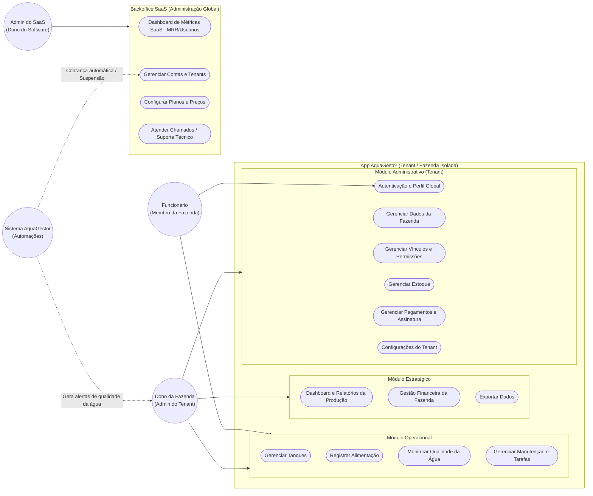

# Diagrama de Casos de Uso

Abaixo está a representação dos principais casos de uso do sistema AquaGestor, com nomenclaturas claras separando o dono do software e o inquilino.

```mermaid
flowchart LR
    %% Atores
    AdminSaaS(("Admin do SaaS\n(Dono do Software)"))
    DonoFazenda(("Dono da Fazenda\n(Admin do Tenant)"))
    Funcionario(("Funcionário\n(Membro da Fazenda)"))
    Sistema(("Sistema AquaGestor\n(Automações)"))

    %% Backoffice SaaS (Visão do dono do negócio)
    subgraph BackofficeSaaS ["Backoffice SaaS (Administração Global)"]
        direction TB
        UC_DashSaaS([Dashboard de Métricas SaaS - MRR/Usuários])
        UC_GerenciarClientes([Gerenciar Contas e Tenants])
        UC_GerenciarPlanos([Configurar Planos e Preços])
        UC_SuporteGlobal([Atender Chamados / Suporte Técnico])
    end

    %% App AquaGestor (Visão do Cliente/Produtor)
    subgraph AppAquaGestor ["App AquaGestor (Tenant / Fazenda Isolada)"]
        direction TB
        
        subgraph ModOperacional ["Módulo Operacional"]
            direction TB
            UC_GestaoTanques([Gerenciar Tanques])
            UC_RegistrarAlimentacao([Registrar Alimentação])
            UC_MedirAgua([Monitorar Qualidade da Água])
            UC_Manutencao([Gerenciar Manutenção e Tarefas])
        end
        
        subgraph ModEstrategico ["Módulo Estratégico"]
            direction TB
            UC_Dashboard([Dashboard e Relatórios da Produção])
            UC_Financas([Gestão Financeira da Fazenda])
            UC_Exportar([Exportar Dados])
        end
        
        subgraph ModAdministrativo ["Módulo Administrativo (Tenant)"]
            direction TB
            UC_Auth([Autenticação e Perfil Global])
            UC_Fazenda([Gerenciar Dados da Fazenda])
            UC_GerenciarEquipe([Gerenciar Vínculos e Permissões])
            UC_GerenciarEstoque([Gerenciar Estoque])
            UC_Assinatura([Gerenciar Pagamentos e Assinatura])
            UC_ConfigAjuda([Configurações do Tenant])
        end
    end

    %% Conexões do Admin SaaS
    AdminSaaS --> BackofficeSaaS

    %% Conexões do Funcionário (Acesso Restrito)
    Funcionario --> UC_Auth
    Funcionario --> ModOperacional

    %% Conexões do Dono da Fazenda (Acesso Total ao seu Tenant)
    DonoFazenda --> ModOperacional
    DonoFazenda --> ModEstrategico
    DonoFazenda --> ModAdministrativo
    
    %% Alertas e Integrações do Sistema
    Sistema -. "Cobrança automática / Suspensão" .-> UC_GerenciarClientes
    Sistema -. "Gera alertas de qualidade da água" .-> DonoFazenda
```
