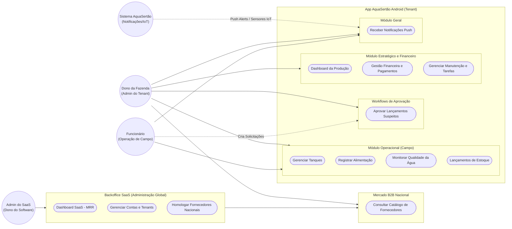

# Diagrama de Casos de Uso

Abaixo está a representação dos principais casos de uso do sistema AquaSertão (Piscicultura Inteligente), refletindo as restrições de permissões entre o Dono da Fazenda e o Funcionário, além dos módulos globais.

