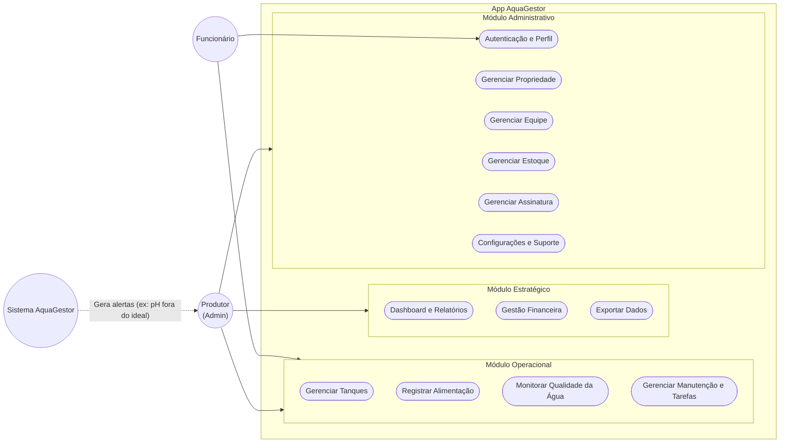

# Diagrama de Casos de Uso

Abaixo está a representação dos principais casos de uso do sistema AquaGestor.

```mermaid
flowchart LR
    %% Atores
    Produtor(("Produtor\n(Admin)"))
    Funcionario(("Funcionário"))
    Sistema(("Sistema AquaGestor"))

    %% App
    subgraph AppAquaGestor ["App AquaGestor"]
        direction TB
        
        subgraph ModOperacional ["Módulo Operacional"]
            direction TB
            UC_GestaoTanques([Gerenciar Tanques])
            UC_RegistrarAlimentacao([Registrar Alimentação])
            UC_MedirAgua([Monitorar Qualidade da Água])
            UC_Manutencao([Gerenciar Manutenção e Tarefas])
        end
        
        subgraph ModEstrategico ["Módulo Estratégico"]
            direction TB
            UC_Dashboard([Dashboard e Relatórios])
            UC_Financas([Gestão Financeira])
            UC_Exportar([Exportar Dados])
        end
        
        subgraph ModAdministrativo ["Módulo Administrativo"]
            direction TB
            UC_Auth([Autenticação e Perfil])
            UC_Propriedade([Gerenciar Propriedade])
            UC_GerenciarEquipe([Gerenciar Equipe])
            UC_GerenciarEstoque([Gerenciar Estoque])
            UC_Assinatura([Gerenciar Assinatura])
            UC_ConfigAjuda([Configurações e Suporte])
        end
    end

    %% Conexões do Funcionário (Acesso Restrito)
    Funcionario --> UC_Auth
    Funcionario --> ModOperacional

    %% Conexões do Produtor (Acesso Total)
    Produtor --> ModOperacional
    Produtor --> ModEstrategico
    Produtor --> ModAdministrativo
    
    %% Alertas do Sistema
    Sistema -. "Gera alertas (ex: pH fora do ideal)" .-> Produtor
```
