# Diagrama ER (Entidade-Relacionamento)

Abaixo está o modelo físico/conceitual exato do banco de dados atualizado para a versão 2.0 da arquitetura SaaS, baseado nas migrações reais do Flyway (`V1` até `V4`), incluindo imagens customizadas, permissões de operador de campo, faturas e colheitas.

```mermaid
erDiagram
    %% ==========================================
    %% MÓDULO: NÚCLEO SaaS (GLOBAL & MARKETPLACE)
    %% ==========================================
    
    global_user {
        uuid id PK
        varchar name
        varchar email UK
        varchar password
        varchar account_type "SAAS_ADMIN, CLIENT"
        timestamp created_at
        text profile_image
    }

    national_supplier {
        uuid id PK
        varchar company_name
        varchar cnpj UK
        varchar supply_type "Ração, Alevinos, etc."
        boolean is_approved
    }

    %% ==========================================
    %% MÓDULO: INQUILINOS (TENANTS)
    %% ==========================================
    
    farm_tenant {
        uuid id PK
        varchar name
        varchar cnpj UK
        uuid owner_id FK
        timestamp created_at
    }

    user_farm_link {
        uuid user_id PK, FK
        uuid farm_id PK, FK
        varchar access_role "FARM_OWNER, MANAGER, FIELD_WORKER"
    }

    %% ==========================================
    %% MÓDULO: ASSINATURAS E FATURAMENTO (BILLING)
    %% ==========================================

    saas_plan {
        uuid id PK
        varchar name UK
        integer max_tanks
        integer max_users
        numeric price_monthly
    }

    subscription {
        uuid id PK
        uuid farm_id UK, FK
        uuid plan_id FK
        date start_date
        date end_date
        varchar status "ACTIVE, EXPIRED, CANCELLED"
    }

    invoice {
        uuid id PK
        uuid subscription_id FK
        numeric amount
        date due_date
        date paid_date
        varchar status "PENDING, PAID, OVERDUE"
    }

    %% ==========================================
    %% MÓDULO: OPERACIONAL (TANQUES E DADOS DIÁRIOS)
    %% ==========================================

    tank {
        uuid id PK
        uuid farm_id FK
        varchar name
        varchar fish_species
        integer fish_capacity
        integer average_weight_g
        integer mortality_count
        date next_harvest_date
        varchar status "ACTIVE, INACTIVE"
        text custom_image
    }

    inventory {
        uuid id PK
        uuid farm_id FK
        varchar item_name
        numeric quantity
        varchar unit "kg, unidade, etc."
        varchar type "Alimento, Medicamento, etc."
    }

    feeding_record {
        uuid id PK
        uuid farm_id FK
        uuid tank_id FK
        uuid user_id FK
        uuid feed_id FK "inventory.id"
        numeric quantity
        timestamp feeding_time
    }

    water_quality {
        uuid id PK
        uuid farm_id FK
        uuid tank_id FK
        numeric ph
        numeric temperature
        numeric dissolved_oxygen
        timestamp measurement_time
    }

    harvest {
        uuid id PK
        uuid farm_id FK
        uuid tank_id FK
        date date
        numeric quantity_kg
        varchar destination
    }

    maintenance {
        uuid id PK
        uuid farm_id FK
        uuid tank_id FK
        text description
        varchar status "PENDING, COMPLETED"
        date scheduled_date
    }

    %% ==========================================
    %% MÓDULO: EXCLUSIVO DO DONO & WORKFLOWS
    %% ==========================================

    financial_transaction {
        uuid id PK
        uuid farm_id FK
        varchar type "Income, Expense"
        numeric amount
        timestamp transaction_date
    }

    approval_request {
        uuid id PK
        uuid farm_id FK
        uuid requester_id FK
        text requested_action
        varchar status "Pending, Approved, Rejected"
        timestamp request_date
    }

    notification {
        uuid id PK
        uuid target_user_id FK
        varchar type
        text message
        boolean is_read
        timestamp created_at
    }

    employee_module_permission {
        uuid employee_id PK, FK
        uuid farm_id PK, FK
        varchar module_name PK
        boolean is_enabled
    }

    %% ==========================================
    %% RELACIONAMENTOS (O MOTOR DO SAAS)
    %% ==========================================

    %% Acessos
    global_user ||--o{ farm_tenant : "é dono de"
    global_user ||--o{ user_farm_link : "possui"
    farm_tenant ||--o{ user_farm_link : "concede acesso via"
    
    %% Faturamento
    saas_plan ||--o{ subscription : "define"
    farm_tenant ||--|| subscription : "assina"
    subscription ||--o{ invoice : "gera"

    %% Dados Isolados do Tenant (Multitenancy)
    farm_tenant ||--o{ tank : "possui"
    farm_tenant ||--o{ financial_transaction : "registra"
    farm_tenant ||--o{ inventory : "mantém"
    farm_tenant ||--o{ feeding_record : "gerencia"
    farm_tenant ||--o{ water_quality : "monitora"
    farm_tenant ||--o{ harvest : "registra"
    farm_tenant ||--o{ maintenance : "programa"
    farm_tenant ||--o{ approval_request : "recebe"
    farm_tenant ||--o{ employee_module_permission : "configura"
    
    %% Relacionamentos do Operacional
    tank ||--o{ feeding_record : "recebe"
    tank ||--o{ water_quality : "monitora"
    tank ||--o{ harvest : "retira"
    tank ||--o{ maintenance : "sofre"
    
    %% Notificações, Permissões e Aprovações de Usuário
    global_user ||--o{ notification : "recebe"
    global_user ||--o{ approval_request : "solicita"
    global_user ||--o{ feeding_record : "registra"
    global_user ||--o{ employee_module_permission : "recebe"
```

