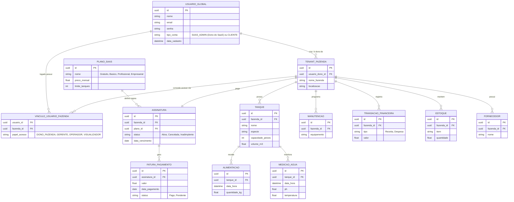

# Diagrama ER (Entidade-Relacionamento)

Abaixo está o modelo conceitual atualizado para uma arquitetura SaaS robusta, utilizando nomenclaturas explícitas que "denunciam" exatamente o papel de cada entidade no sistema Multi-Tenant.

