# Diagrama ER (Entidade-Relacionamento)

Abaixo está o modelo conceitual atualizado para a versão 2.0 da arquitetura SaaS, incluindo Módulo Nacional de Fornecedores, Notificações e Sistema de Aprovação (Workflows).

```mermaid
erDiagram
    %% ==========================================
    %% MÓDULO: NÚCLEO SaaS (GLOBAL E MARKETPLACE)
    %% ==========================================
    
    USUARIO_GLOBAL {
        uuid id PK
        string nome
        string email
        string senha
        string tipo_conta "SAAS_ADMIN ou CLIENTE"
        datetime data_cadastro
    }

    FORNECEDOR_NACIONAL {
        uuid id PK
        string nome_empresa
        string cnpj
        string tipo_insumo "Ração, Alevino, Equipamento"
        boolean homologado
    }

    %% ==========================================
    %% MÓDULO: INQUILINOS (O ESPAÇO DE CADA CLIENTE)
    %% ==========================================
    
    TENANT_FAZENDA {
        uuid id PK
        uuid usuario_dono_id FK
        string nome_fazenda
        string localizacao
    }

    VINCULO_USUARIO_FAZENDA {
        uuid usuario_id FK
        uuid fazenda_id FK
        string papel_acesso "DONO_FAZENDA, GERENTE, FUNCIONARIO_CAMPO"
    }

    %% ==========================================
    %% MÓDULO: ASSINATURAS E FATURAMENTO (BILLING)
    %% ==========================================

    PLANO_SAAS {
        uuid id PK
        string nome
        float preco_mensal
    }

    ASSINATURA {
        uuid id PK
        uuid fazenda_id FK
        uuid plano_id FK
        string status
    }

    %% ==========================================
    %% MÓDULO: OPERACIONAL (ACESSO: DONO E FUNCIONÁRIO)
    %% ==========================================
    TANQUE {
        uuid id PK
        uuid fazenda_id FK
        string nome
        string especie
    }

    ALIMENTACAO {
        uuid id PK
        uuid tanque_id FK
        datetime data_hora
        float quantidade_kg
    }

    MEDICAO_AGUA {
        uuid id PK
        uuid tanque_id FK
        datetime data_hora
        float ph
        float temperatura
    }

    ESTOQUE {
        uuid id PK
        uuid fazenda_id FK
        string item
        float quantidade
        uuid fornecedor_nacional_id FK
    }

    %% ==========================================
    %% MÓDULO: EXCLUSIVO DO DONO E WORKFLOWS
    %% ==========================================

    TRANSACAO_FINANCEIRA {
        uuid id PK
        uuid fazenda_id FK
        string tipo "Receita, Despesa"
        float valor
    }

    MANUTENCAO {
        uuid id PK
        uuid fazenda_id FK
        string equipamento
        string status
    }

    SOLICITACAO_APROVACAO {
        uuid id PK
        uuid fazenda_id FK
        uuid solicitante_id FK
        string acao_requisitada "Ex: Baixa de 1000kg de ração"
        string status "Pendente, Aprovada, Recusada"
    }

    NOTIFICACAO {
        uuid id PK
        uuid usuario_destino_id FK
        string tipo "Alerta IoT, Fatura, Tarefa"
        string mensagem
        boolean lida
    }

    %% ==========================================
    %% RELACIONAMENTOS (O MOTOR DO SAAS)
    %% ==========================================

    %% Acessos
    USUARIO_GLOBAL ||--o{ TENANT_FAZENDA : "é dono de"
    USUARIO_GLOBAL ||--o{ VINCULO_USUARIO_FAZENDA : "logado possui"
    TENANT_FAZENDA ||--o{ VINCULO_USUARIO_FAZENDA : "concede acesso via"
    
    %% Faturamento
    PLANO_SAAS ||--o{ ASSINATURA : "define regras"
    TENANT_FAZENDA ||--|| ASSINATURA : "paga"

    %% Dados Isolados do Tenant
    TENANT_FAZENDA ||--o{ TANQUE : "possui"
    TENANT_FAZENDA ||--o{ TRANSACAO_FINANCEIRA : "registra"
    TENANT_FAZENDA ||--o{ ESTOQUE : "mantem"
    TENANT_FAZENDA ||--o{ MANUTENCAO : "programa"
    TENANT_FAZENDA ||--o{ SOLICITACAO_APROVACAO : "gera"
    
    %% Relacionamentos do Operacional
    TANQUE ||--o{ ALIMENTACAO : "recebe"
    TANQUE ||--o{ MEDICAO_AGUA : "monitora"
    FORNECEDOR_NACIONAL ||--o{ ESTOQUE : "abastece"
    USUARIO_GLOBAL ||--o{ NOTIFICACAO : "recebe"
    USUARIO_GLOBAL ||--o{ SOLICITACAO_APROVACAO : "cria"
```

