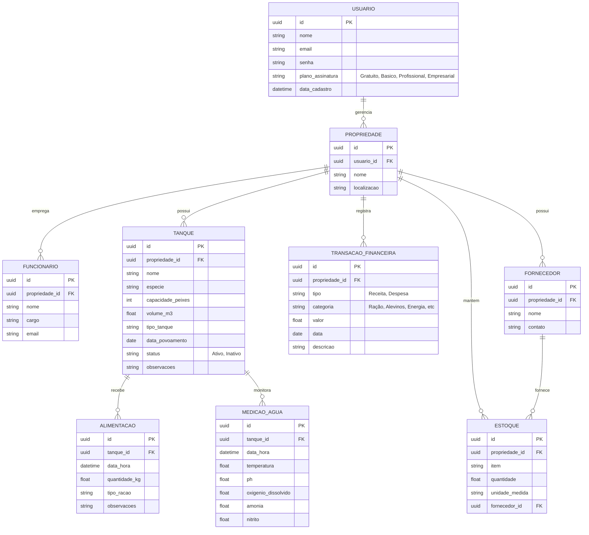

# Diagrama ER (Entidade-Relacionamento)

Abaixo está o modelo conceitual inicial do banco de dados do sistema AquaGestor, focado nos requisitos levantados até o momento.

```mermaid
erDiagram
    USUARIO {
        uuid id PK
        string nome
        string email
        string senha
        string plano_assinatura "Gratuito, Basico, Profissional, Empresarial"
        datetime data_cadastro
    }

    PROPRIEDADE {
        uuid id PK
        uuid usuario_id FK
        string nome
        string localizacao
    }

    FUNCIONARIO {
        uuid id PK
        uuid propriedade_id FK
        string nome
        string cargo
        string email
    }

    TANQUE {
        uuid id PK
        uuid propriedade_id FK
        string nome
        string especie
        int capacidade_peixes
        float volume_m3
        string tipo_tanque
        date data_povoamento
        string status "Ativo, Inativo"
        string observacoes
    }

    ALIMENTACAO {
        uuid id PK
        uuid tanque_id FK
        datetime data_hora
        float quantidade_kg
        string tipo_racao
        string observacoes
    }

    MEDICAO_AGUA {
        uuid id PK
        uuid tanque_id FK
        datetime data_hora
        float temperatura
        float ph
        float oxigenio_dissolvido
        float amonia
        float nitrito
    }

    TRANSACAO_FINANCEIRA {
        uuid id PK
        uuid propriedade_id FK
        string tipo "Receita, Despesa"
        string categoria "Ração, Alevinos, Energia, etc"
        float valor
        date data
        string descricao
    }

    ESTOQUE {
        uuid id PK
        uuid propriedade_id FK
        string item
        float quantidade
        string unidade_medida
        uuid fornecedor_id FK
    }

    FORNECEDOR {
        uuid id PK
        uuid propriedade_id FK
        string nome
        string contato
    }

    USUARIO ||--o{ PROPRIEDADE : "gerencia"
    PROPRIEDADE ||--o{ FUNCIONARIO : "emprega"
    PROPRIEDADE ||--o{ TANQUE : "possui"
    PROPRIEDADE ||--o{ TRANSACAO_FINANCEIRA : "registra"
    PROPRIEDADE ||--o{ ESTOQUE : "mantem"
    PROPRIEDADE ||--o{ FORNECEDOR : "possui"
    
    TANQUE ||--o{ ALIMENTACAO : "recebe"
    TANQUE ||--o{ MEDICAO_AGUA : "monitora"
    FORNECEDOR ||--o{ ESTOQUE : "fornece"
```
